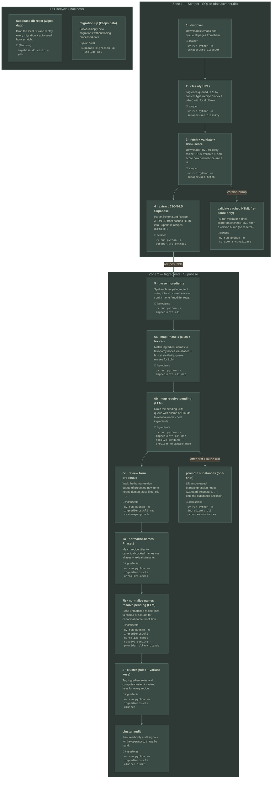

# Pipeline cheatsheet

```mermaid
%%{init: {'theme':'base', 'themeVariables': {
  'background': '#2a3531',
  'primaryColor': '#3a4a44',
  'primaryTextColor': '#c4ccbd',
  'primaryBorderColor': '#6b8a82',
  'lineColor': '#7a978a',
  'clusterBkg': '#2e3936',
  'clusterBorder': '#4a5e58',
  'fontFamily': 'system-ui, -apple-system, sans-serif'
}}}%%
flowchart TD
    subgraph Z1 ["Zone 1 — Scraper · SQLite (data/scraper.db)"]
        direction TB
        D["<div style='text-align:left;padding:6px;line-height:1.45'><div style='font-weight:600;font-size:15px;color:#dfe5d8;margin-bottom:6px'>1 · discover</div><div style='font-size:14px;color:#adb8a4;margin-bottom:10px'>Download sitemaps and queue all pages from them.</div><div style='font-size:13px;color:#859189;margin-bottom:8px'>📁 <i>scraper</i></div><div style='font-family:ui-monospace,Menlo,Consolas,monospace;font-size:13px;border:1px dashed #6b8a82;background:#2a3531;padding:6px 8px;border-radius:4px;color:#c4ccbd'>uv run python -m scraper.src.discover</div></div>"]
        C["<div style='text-align:left;padding:6px;line-height:1.45'><div style='font-weight:600;font-size:15px;color:#dfe5d8;margin-bottom:6px'>2 · classify URLs</div><div style='font-size:14px;color:#adb8a4;margin-bottom:10px'>Tag each queued URL by content type (recipe / index / other) with local ollama.</div><div style='font-size:13px;color:#859189;margin-bottom:8px'>📁 <i>scraper</i></div><div style='font-family:ui-monospace,Menlo,Consolas,monospace;font-size:13px;border:1px dashed #6b8a82;background:#2a3531;padding:6px 8px;border-radius:4px;color:#c4ccbd'>uv run python -m scraper.src.classify</div></div>"]
        F["<div style='text-align:left;padding:6px;line-height:1.45'><div style='font-weight:600;font-size:15px;color:#dfe5d8;margin-bottom:6px'>3 · fetch + validate + drink-score</div><div style='font-size:14px;color:#adb8a4;margin-bottom:10px'>Download HTML for likely-recipe URLs, validate it, and score how drink-recipe-like it is.</div><div style='font-size:13px;color:#859189;margin-bottom:8px'>📁 <i>scraper</i></div><div style='font-family:ui-monospace,Menlo,Consolas,monospace;font-size:13px;border:1px dashed #6b8a82;background:#2a3531;padding:6px 8px;border-radius:4px;color:#c4ccbd'>uv run python -m scraper.src.fetch</div></div>"]
        E["<div style='text-align:left;padding:6px;line-height:1.45'><div style='font-weight:600;font-size:15px;color:#dfe5d8;margin-bottom:6px'>4 · extract JSON-LD → Supabase</div><div style='font-size:14px;color:#adb8a4;margin-bottom:10px'>Parse Schema.org Recipe JSON-LD from cached HTML into Supabase recipes (UPSERT).</div><div style='font-size:13px;color:#859189;margin-bottom:8px'>📁 <i>scraper</i></div><div style='font-family:ui-monospace,Menlo,Consolas,monospace;font-size:13px;border:1px dashed #6b8a82;background:#2a3531;padding:6px 8px;border-radius:4px;color:#c4ccbd'>uv run python -m scraper.src.extract</div></div>"]
        V["<div style='text-align:left;padding:6px;line-height:1.45'><div style='font-weight:600;font-size:15px;color:#dfe5d8;margin-bottom:6px'>validate cached HTML (re-score only)</div><div style='font-size:14px;color:#adb8a4;margin-bottom:10px'>Re-run validator + drink-scorer on cached HTML after a version bump (no re-fetch).</div><div style='font-size:13px;color:#859189;margin-bottom:8px'>📁 <i>scraper</i></div><div style='font-family:ui-monospace,Menlo,Consolas,monospace;font-size:13px;border:1px dashed #6b8a82;background:#2a3531;padding:6px 8px;border-radius:4px;color:#c4ccbd'>uv run python -m scraper.src.validate</div></div>"]
        D --> C --> F --> E
        F -. version bump .-> V
    end

    subgraph Z2 ["Zone 2 — Ingredients · Supabase"]
        direction TB
        P["<div style='text-align:left;padding:6px;line-height:1.45'><div style='font-weight:600;font-size:15px;color:#dfe5d8;margin-bottom:6px'>5 · parse ingredients</div><div style='font-size:14px;color:#adb8a4;margin-bottom:10px'>Split each recipeIngredient string into structured amount / unit / name / modifier rows.</div><div style='font-size:13px;color:#859189;margin-bottom:8px'>📁 <i>ingredients</i></div><div style='font-family:ui-monospace,Menlo,Consolas,monospace;font-size:13px;border:1px dashed #6b8a82;background:#2a3531;padding:6px 8px;border-radius:4px;color:#c4ccbd'>uv run python -m ingredients.cli</div></div>"]
        M1["<div style='text-align:left;padding:6px;line-height:1.45'><div style='font-weight:600;font-size:15px;color:#dfe5d8;margin-bottom:6px'>6a · map Phase 1 (alias + lexical)</div><div style='font-size:14px;color:#adb8a4;margin-bottom:10px'>Match ingredient names to taxonomy nodes via aliases + lexical similarity, queue misses for LLM.</div><div style='font-size:13px;color:#859189;margin-bottom:8px'>📁 <i>ingredients</i></div><div style='font-family:ui-monospace,Menlo,Consolas,monospace;font-size:13px;border:1px dashed #6b8a82;background:#2a3531;padding:6px 8px;border-radius:4px;color:#c4ccbd'>uv run python -m ingredients.cli map</div></div>"]
        M2["<div style='text-align:left;padding:6px;line-height:1.45'><div style='font-weight:600;font-size:15px;color:#dfe5d8;margin-bottom:6px'>6b · map resolve-pending (LLM)</div><div style='font-size:14px;color:#adb8a4;margin-bottom:10px'>Drain the pending-LLM queue with ollama or Claude to resolve unmatched ingredients.</div><div style='font-size:13px;color:#859189;margin-bottom:8px'>📁 <i>ingredients</i></div><div style='font-family:ui-monospace,Menlo,Consolas,monospace;font-size:13px;border:1px dashed #6b8a82;background:#2a3531;padding:6px 8px;border-radius:4px;color:#c4ccbd'>uv run python -m ingredients.cli map resolve-pending --provider ollama|claude</div></div>"]
        RP["<div style='text-align:left;padding:6px;line-height:1.45'><div style='font-weight:600;font-size:15px;color:#dfe5d8;margin-bottom:6px'>6c · review form proposals</div><div style='font-size:14px;color:#adb8a4;margin-bottom:10px'>Walk the human-review queue of proposed new form nodes (lemon_zest, lime_oil, …).</div><div style='font-size:13px;color:#859189;margin-bottom:8px'>📁 <i>ingredients</i></div><div style='font-family:ui-monospace,Menlo,Consolas,monospace;font-size:13px;border:1px dashed #6b8a82;background:#2a3531;padding:6px 8px;border-radius:4px;color:#c4ccbd'>uv run python -m ingredients.cli map review-proposals</div></div>"]
        PS["<div style='text-align:left;padding:6px;line-height:1.45'><div style='font-weight:600;font-size:15px;color:#dfe5d8;margin-bottom:6px'>promote substances (one-shot)</div><div style='font-size:14px;color:#adb8a4;margin-bottom:10px'>Lift auto-created brand/expression nodes (Campari, Angostura, …) onto the substance antichain.</div><div style='font-size:13px;color:#859189;margin-bottom:8px'>📁 <i>ingredients</i></div><div style='font-family:ui-monospace,Menlo,Consolas,monospace;font-size:13px;border:1px dashed #6b8a82;background:#2a3531;padding:6px 8px;border-radius:4px;color:#c4ccbd'>uv run python -m ingredients.cli promote-substances</div></div>"]
        N1["<div style='text-align:left;padding:6px;line-height:1.45'><div style='font-weight:600;font-size:15px;color:#dfe5d8;margin-bottom:6px'>7a · normalize-names Phase 1</div><div style='font-size:14px;color:#adb8a4;margin-bottom:10px'>Match recipe titles to canonical cocktail names via aliases + lexical similarity.</div><div style='font-size:13px;color:#859189;margin-bottom:8px'>📁 <i>ingredients</i></div><div style='font-family:ui-monospace,Menlo,Consolas,monospace;font-size:13px;border:1px dashed #6b8a82;background:#2a3531;padding:6px 8px;border-radius:4px;color:#c4ccbd'>uv run python -m ingredients.cli normalize-names</div></div>"]
        N2["<div style='text-align:left;padding:6px;line-height:1.45'><div style='font-weight:600;font-size:15px;color:#dfe5d8;margin-bottom:6px'>7b · normalize-names resolve-pending (LLM)</div><div style='font-size:14px;color:#adb8a4;margin-bottom:10px'>Send unmatched recipe titles to ollama or Claude for canonical-name resolution.</div><div style='font-size:13px;color:#859189;margin-bottom:8px'>📁 <i>ingredients</i></div><div style='font-family:ui-monospace,Menlo,Consolas,monospace;font-size:13px;border:1px dashed #6b8a82;background:#2a3531;padding:6px 8px;border-radius:4px;color:#c4ccbd'>uv run python -m ingredients.cli normalize-names resolve-pending --provider ollama|claude</div></div>"]
        CL["<div style='text-align:left;padding:6px;line-height:1.45'><div style='font-weight:600;font-size:15px;color:#dfe5d8;margin-bottom:6px'>8 · cluster (roles + variant keys)</div><div style='font-size:14px;color:#adb8a4;margin-bottom:10px'>Tag ingredient roles and compute cluster + variant keys for every recipe.</div><div style='font-size:13px;color:#859189;margin-bottom:8px'>📁 <i>ingredients</i></div><div style='font-family:ui-monospace,Menlo,Consolas,monospace;font-size:13px;border:1px dashed #6b8a82;background:#2a3531;padding:6px 8px;border-radius:4px;color:#c4ccbd'>uv run python -m ingredients.cli cluster</div></div>"]
        AU["<div style='text-align:left;padding:6px;line-height:1.45'><div style='font-weight:600;font-size:15px;color:#dfe5d8;margin-bottom:6px'>cluster audit</div><div style='font-size:14px;color:#adb8a4;margin-bottom:10px'>Print read-only audit signals for the operator to triage by hand.</div><div style='font-size:13px;color:#859189;margin-bottom:8px'>📁 <i>ingredients</i></div><div style='font-family:ui-monospace,Menlo,Consolas,monospace;font-size:13px;border:1px dashed #6b8a82;background:#2a3531;padding:6px 8px;border-radius:4px;color:#c4ccbd'>uv run python -m ingredients.cli cluster audit</div></div>"]
        P --> M1 --> M2 --> RP --> N1 --> N2 --> CL --> AU
        M2 -. after first Claude run .-> PS
    end

    subgraph DBL ["DB lifecycle (Mac host)"]
        direction TB
        RST["<div style='text-align:left;padding:6px;line-height:1.45'><div style='font-weight:600;font-size:15px;color:#dfe5d8;margin-bottom:6px'>supabase db reset (wipes data)</div><div style='font-size:14px;color:#adb8a4;margin-bottom:10px'>Drop the local DB and replay every migration + auto-seed from scratch.</div><div style='font-size:13px;color:#859189;margin-bottom:8px'>📁 <i>(Mac host)</i></div><div style='font-family:ui-monospace,Menlo,Consolas,monospace;font-size:13px;border:1px dashed #6b8a82;background:#2a3531;padding:6px 8px;border-radius:4px;color:#c4ccbd'>supabase db reset --yes</div></div>"]
        MIG["<div style='text-align:left;padding:6px;line-height:1.45'><div style='font-weight:600;font-size:15px;color:#dfe5d8;margin-bottom:6px'>migration up (keeps data)</div><div style='font-size:14px;color:#adb8a4;margin-bottom:10px'>Forward-apply new migrations without losing processed data.</div><div style='font-size:13px;color:#859189;margin-bottom:8px'>📁 <i>(Mac host)</i></div><div style='font-family:ui-monospace,Menlo,Consolas,monospace;font-size:13px;border:1px dashed #6b8a82;background:#2a3531;padding:6px 8px;border-radius:4px;color:#c4ccbd'>supabase migration up --include-all</div></div>"]
    end

    E ==>|recipes table| P
```
