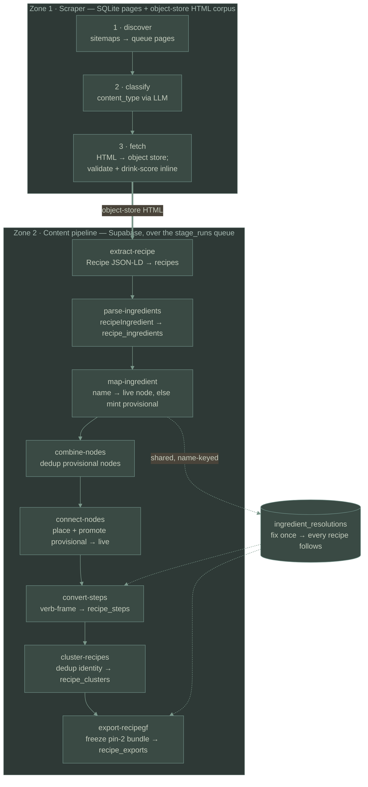

# Pipeline — data flow

The pipeline runs in two zones. **Zone 1** (the `scraper/` package — SQLite plus
the object-store HTML corpus) crawls the web into two durable inputs: per-URL `pages` state
and the write-once HTML corpus. **Zone 2** (the `ingredients/` package —
Supabase) turns those into the relational recipe and its published RecipeGF
bundle.

Every Zone-2 stage is a `stage_fn` over the `stage_runs` work queue: a stage's
queue is "content qualifies AND has no run at the current version," so a re-run
only touches what a prior run left undone. Zone-2 stages run two ways — one-off
and deterministically via the CLI (`ingredients.cli <stage>` / `cold-build`, where `<stage>` is one of `extract-recipe`, `parse-ingredients`, `map-ingredient`, `combine-nodes`, `connect-nodes`, `convert-steps`, `cluster-recipes`, `export-recipegf`), or
continuously via the worker daemon off the `jobs` queue (which adds the LLM
provider tiers and a per-job cost cap). Command surface and versioning live in
[CLAUDE.md](../CLAUDE.md).

Between mapping and step conversion sit two **taxonomy-harmonization**
stages, both keyed on the `taxonomy_node` entity. `map-ingredient` resolves
a name to an existing **live** node or, on abstain, mechanically mints a
`provisional` stub (deterministic slug, no parent, no LLM). `combine-nodes`
then dedups those stubs against each other and the live set, and
`connect-nodes` places each survivor (kind + parents + `is_cluster_node`)
and flips it `provisional → live`; uncertain cases in either stage open a
`human_reviews` row and leave the node provisional. Downstream stages —
`convert-steps`, `cluster-recipes`, `export-recipegf` — treat a recipe with
any still-`provisional` ingredient node as `pending` and emit nothing for it
until its nodes are promoted, so provisional nodes never reach a cluster,
a step set, an export, or the public views.

Only the fetched HTML corpus and the `pages` rows are the crawl's durable
output; everything downstream regenerates from them, so any stage is safe to
re-run (delete its `stage_runs` rows, or bump the stage's version constant). The
consumer-facing RecipeGF bundle is itself a projection — generated on demand from
the relational rows and frozen into `recipe_exports` only on export; see
[recipegf-export.md](recipegf-export.md).
